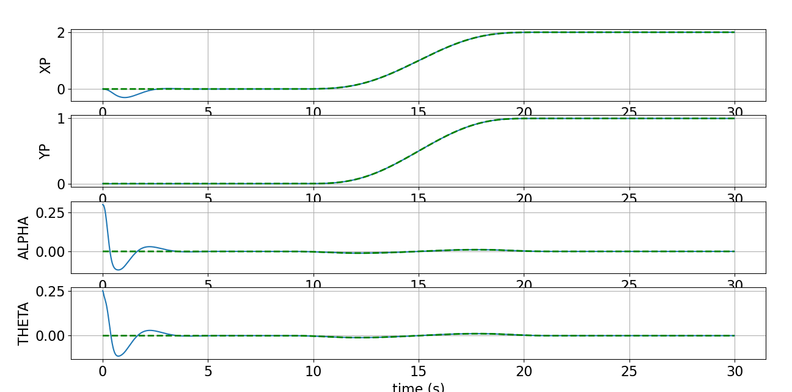
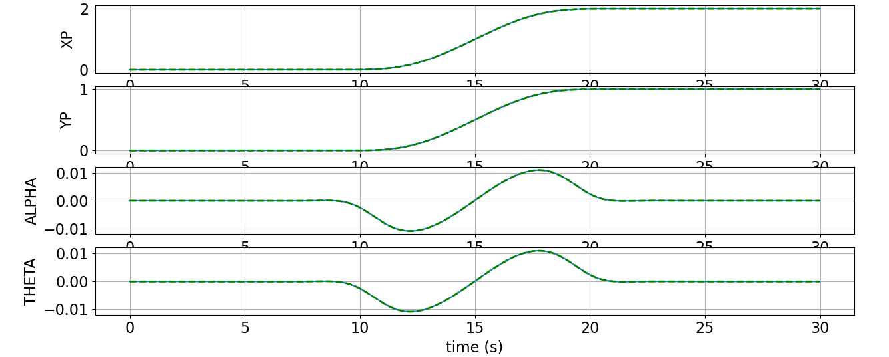
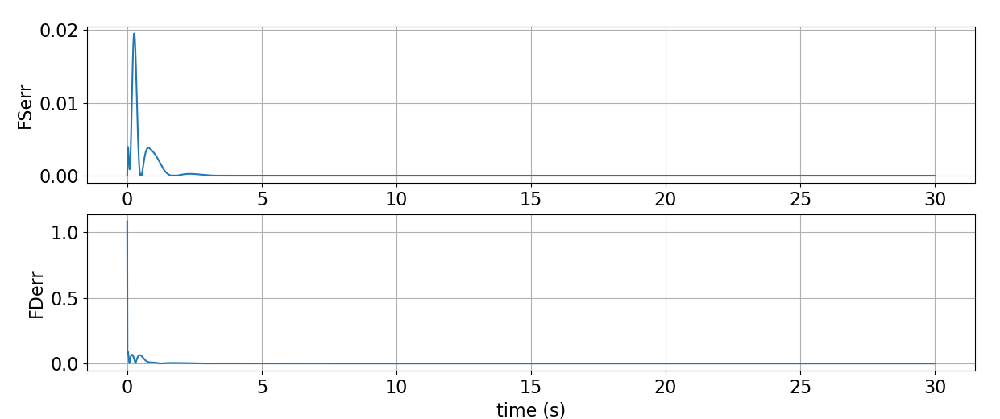

# Optimal Control of a Quadrotor with Suspended Load

[](https://www.python.org/)  
Optimal trajectory generation and tracking using Newton's method, LQR, and MPC.

---

## 🧠 About the Project

This project focuses on the **design of an optimal feedback controller** for a planar quadrotor carrying a suspended load. It was developed as part of the final exam for the *Optimal Control* course at the University of Bologna.

We simulate the following phases:

- 🚀 **Trajectory generation** via Newton’s Method  
- 🎯 **Tracking** using **LQR** and **MPC**
- 🎥 **Animation** of the quadrotor-load system in motion

Two types of references are supported:
- `Step` (instant jump between positions)
- `Smooth` (5th-order poly curves)
- `DoubleS` (complex reference with rise/dwell/fall)

---

## 🗂 Project Structure

```
📦 quadrotor-optimal-control
┣ 📜 Andrea_Perna3_Quadrotor_Project.py         # Main script
┣ 📜 Parameters.yaml                             # Configuration file
┣ 📜 RefCurve.py                                 # Reference generation (poly5, step, DoubleS)
┣ 📜 Dynamics.py                                 # System dynamics and Jacobians
┣ 📄 technical_report.pdf                        # Full technical report
┣ 📁 images/                                     # Simulation snapshots
┃ ┣ 📷 trajectory_step.png
┃ ┣ 📷 trajectory_smooth.png
┃ ┗ 📷 tracking_mpc.png
```

---

## 🛠 How to Run

Run the main script:

```bash
python Andrea_Perna3_Quadrotor_Project.py
```

All configuration and task settings are defined inside the `Parameters` section at the top of the script.

---

## ⚙️ Task Setup

Set the following variables in the `Parameters` section to run specific tasks:

| Task    | ref value    | do_LQR | do_MPC | animations |
|---------|--------------|--------|--------|------------|
| Task 1  | `"Step"`      | False  | False  | False      |
| Task 2  | `"Smooth"`    | False  | False  | False      |
| Task 3  | `"Smooth"`    | True   | False  | True       |
| Task 4  | `"Smooth"`    | False  | True   | True       |
| Task 5  | `"DoubleS"`   | False  | False  | False      |

🧠 **Note:** LQR and MPC require `ref = "Smooth"`.

---

## 📉 Cost Evolution

Newton's method is used to minimize the cost function over state-input trajectories. Regularized Q and R matrices ensure convergence. Armijo backtracking is used for step size selection.

---

## 🎯 Control Strategies

- **LQR**: Linearizes system around optimal trajectory and computes feedback gains via Riccati equations.
- **MPC**: Solves an online constrained optimization problem using CVXPY at each timestep with a receding horizon.

---

## 📈 Key Results & Visualizations

Below are some of the most relevant results from the simulation:

### 📌 System Model


### 📉 Cost Evolution


### 🎯 LQR Trajectory Tracking


### 🤖 MPC Trajectory Tracking


### 🧪 LQR Input Error


### 🌀 Simulation Snapshot


📌 *Animations available during execution with `animations = True`.*

---

## 📎 Resources

- [📘 Technical Report (PDF)](./technical_report.pdf)

---

## 👨‍🎓 Authors

- Andrea Perna
- Davide Corroppoli  
- Riccardo Marras

MSc Automation Engineering – University of Bologna

## 👩‍🏫 Supervisors
- Prof. Giuseppe Notarstefano  
- Dr. Lorenzo Sforni

---

## 📜 License

All rights reserved.
