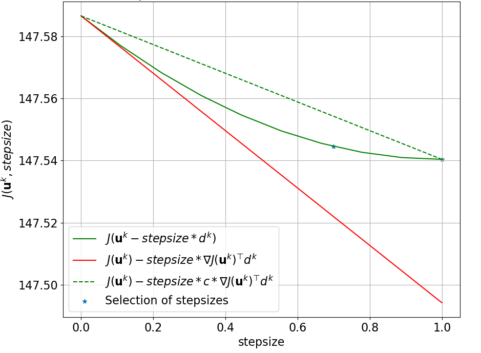
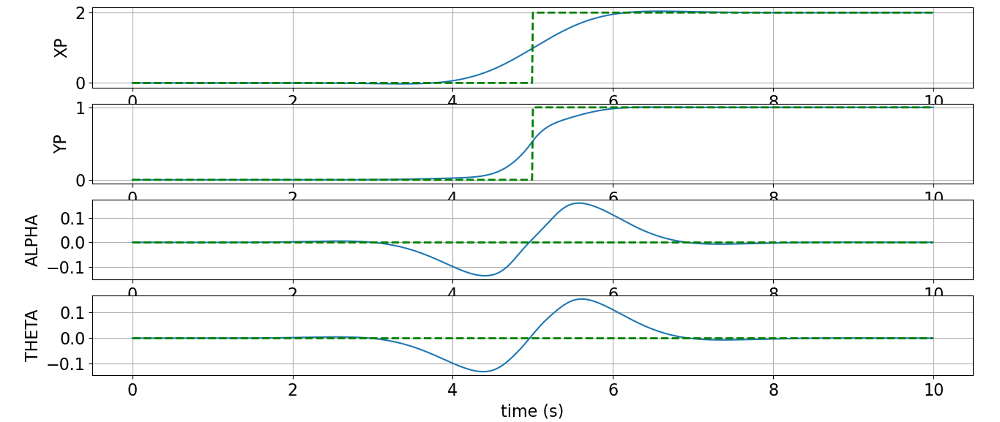
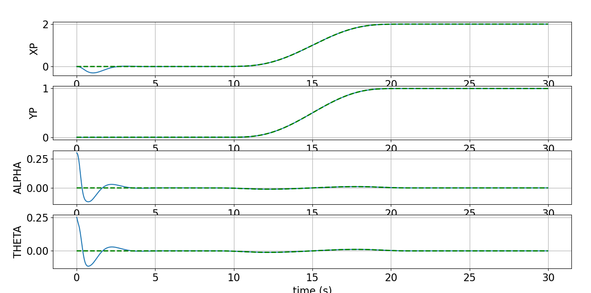
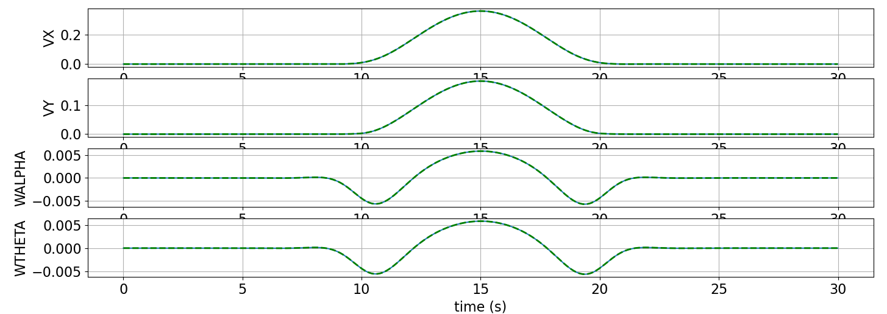
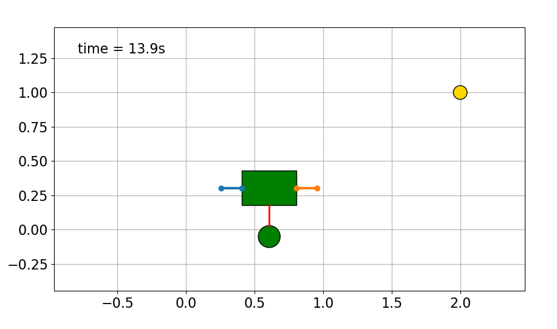

# Optimal Control of a Quadrotor with Suspended Load

[](https://www.python.org/)  
Optimal trajectory generation and tracking using Newton's method, LQR, and MPC.

---

## 🧠 About the Project

This project focuses on the **design of an optimal feedback controller** for a planar quadrotor carrying a suspended load. It was developed as part of the final exam for the *Optimal Control* course at the Master Degree in Automation Engineering, University of Bologna.

We simulate the following phases:

- 🚀 **Trajectory generation** via Newton’s Method  
- 🎯 **Tracking** using **LQR** and **MPC**
- 🎥 **Animation** of the quadrotor-load system in motion

Two types of references are supported:
- `Step` (instant jump between positions)
- `Smooth` (5th-order poly curves)
- `DoubleS` (complex reference with rise/dwell/fall)

---

## 🗂 Project Structure

```
📦 optimal-control-quadrotor/
├── 📁 code/                                  # Python source code for simulation and controllers
│   ├── 💻 OPTCON_project.py                  # Main simulation script
│   ├── 💻 Dynamics.py                        # Quadrotor dynamics and state model
│   ├── 💻 cost.py                            # Cost function for optimization
│   ├── 💻 RefCurve.py                        # Reference trajectory generators
│   ├── 💻 Plot_functions.py                  # Utility functions for plots and animation
│   ├── 💻 Visualization_drone.py             # Visualization module for drone and load
│   ├── 💻 LQR_LTI_Solver.py                  # LQR feedback controller
│   └── 💻 MPC_Solver.py                      # MPC controller using CVXPY
├── 📁 images/                                # Selected result images for README
│   ├── 📸 tracking_NM.png                    # Open-loop trajectory (Newton)
│   ├── 📸 tracking_LQR.png                   # Closed-loop LQR tracking
│   └── 📸 tracking_MPC.png                   # Closed-loop MPC tracking
│   └── 📸 armijo_cost.png                    # Cost fallback with Armijo
├── 📘 technical_report.pdf                   # Full academic technical report
├── 📄 main_quadrotor.pdf                     # Initial template
└── 📄 README.md                              # You are here!
```

---

## 🛠 How to Run

Run the main script:

```bash
python Andrea_Perna3_Quadrotor_Project.py
```

All configuration and task settings are defined inside the `Parameters` section at the top of the script.

---

## ⚙️ Task Setup

Set the following variables in the `Parameters` section to run specific tasks:

| Task    | ref value    | do_LQR | do_MPC | animations |
|---------|--------------|--------|--------|------------|
| Task 1  | `"Step"`      | False  | False  | False      |
| Task 2  | `"Smooth"`    | False  | False  | False      |
| Task 3  | `"Smooth"`    | True   | False  | True       |
| Task 4  | `"Smooth"`    | False  | True   | True       |
| Task 5  | `"DoubleS"`   | False  | False  | False      |

🧠 **Note:** LQR and MPC require `ref = "Smooth"`.

---

## 📉 Cost Evolution

Newton's method is used to minimize the cost function over state-input trajectories. Regularized Q and R matrices ensure convergence. Armijo backtracking is used for step size selection.

---

## 🎯 Control Strategies

### Newton's Method Tracking
Computes the optimal open-loop state-input trajectory by minimizing a weighted cost function using iterative descent and Armijo line search.


### LQR Trajectory Tracking
Linearizes system around optimal trajectory with initial disturbances and computes feedback gains via Riccati equations.


### MPC Trajectory Tracking
Solves an online constrained optimization problem using CVXPY at each timestep with a receding horizon.


---

## 📈 Animation


📌 *Animations available during execution with `animations = True`.*

---

## 📎 Resources

- [📘 Technical Report (PDF)](./technical_report.pdf)

---

## 👨‍🎓 Authors

- Andrea Perna
- Davide Corroppoli  
- Riccardo Marras

MSc Automation Engineering – University of Bologna

## 👩‍🏫 Supervisors
- Prof. Giuseppe Notarstefano  
- Dr. Lorenzo Sforni

---

## 📜 License

All rights reserved.
